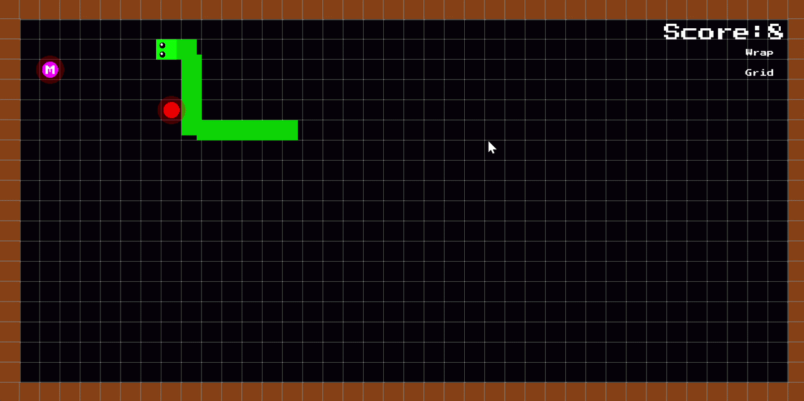
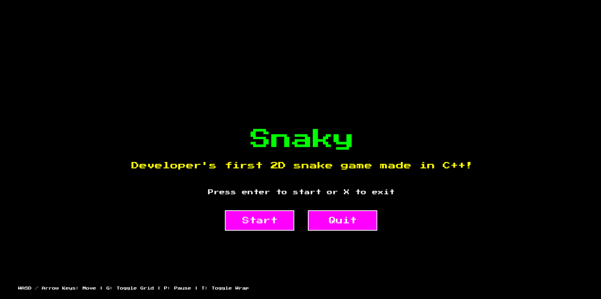
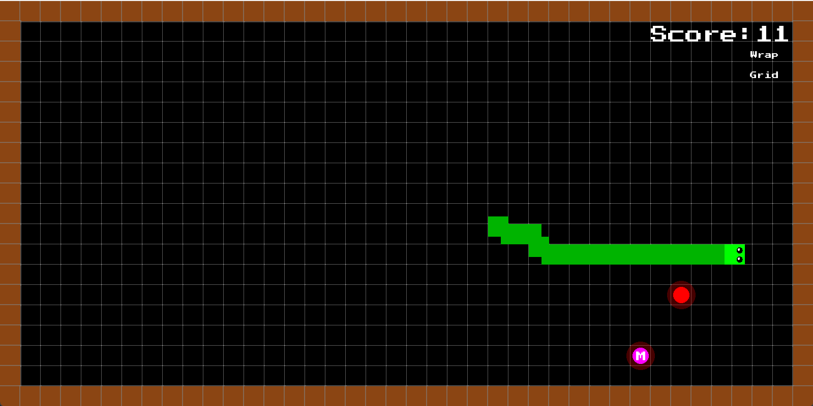
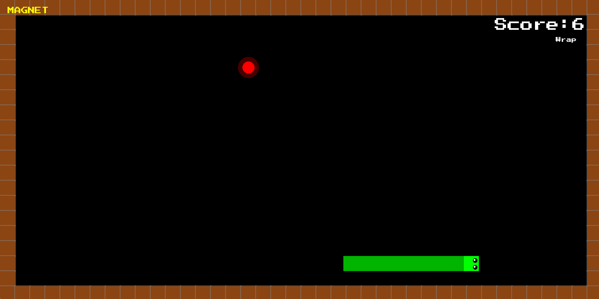
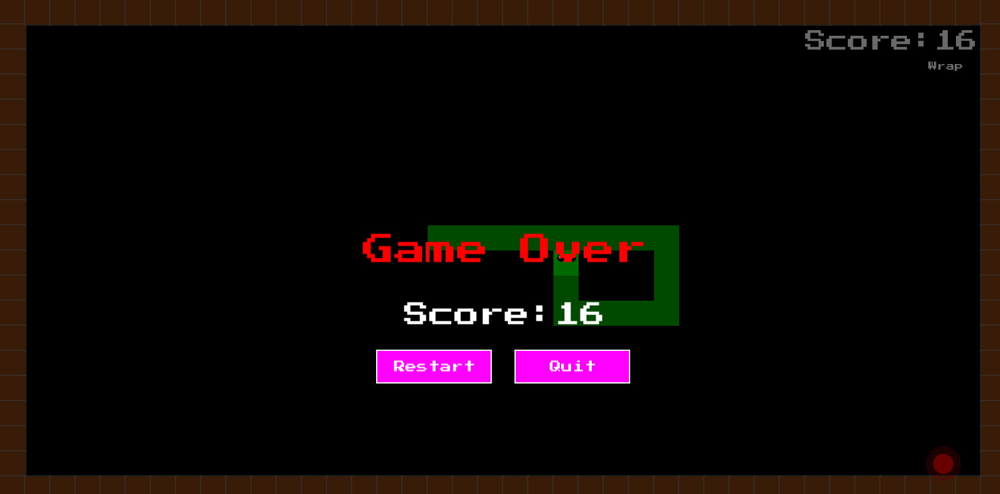

# 🐍 Snaky

### A classic Snake game built from scratch in C++ and SFML

<p align="center">
  <strong>🎮 A small 2D game project focused on learning C++ game development.</strong>
</p>

<p align="center">
  
  
  
  
</p>

<p align="center">
  <a href="#-features">Features</a> •
  <a href="#-controls">Controls</a> •
  <a href="#-gameplay">Gameplay</a> •
  <a href="#-technical-details">Technical Details</a> •
  <a href="#-building">Building</a> •
  <a href="#-future-plans">Future Plans</a>
</p>

---

## 🎮 Gameplay

<p align="center">
  <!-- Replace this with your actual gameplay GIF -->
  
</p>

> 🐍 **Snaky** is a Snake game developed from scratch using **C++ and SFML**.

The project started as an exploration of 2D game development and gradually grew into a small game containing multiple systems including game states, input handling, collision detection, smooth movement, power-ups, UI buttons, and wall wrapping.

---

## ✨ Features

| Feature                     | Description                                             |
| --------------------------- | ------------------------------------------------------- |
| 🐍 **Classic Snake**        | Eat food, grow longer, and increase your score          |
| 🧲 **Magnet Power-Up**      | Collect the magnet to attract food toward the snake     |
| 🌀 **Wall Wrapping**        | Teleport across the opposite side of the map            |
| 📐 **Grid Toggle**          | Toggle the gameplay grid with `G`                       |
| ⏸️ **Pause System**         | Pause and resume the game with `P`                      |
| 🖱️ **Mouse UI**            | Interactive Start, Restart, Resume and Quit buttons     |
| ⌨️ **Keyboard Controls**    | WASD and Arrow Key support                              |
| 👀 **Directional Eyes**     | Snake eyes change based on movement direction           |
| ✨ **Smooth Movement**       | Interpolation makes grid-based movement appear smoother |
| ⚡ **Increasing Difficulty** | The snake becomes faster as you collect food            |

---

## 🧲 Magnet Power-Up

One of the main features that makes Snaky different from a basic Snake implementation is the **Magnet**.

The magnet goes through three states:

```text
       ┌─────────┐
       │ Waiting │
       └────┬────┘
            │
       Spawn timer
            │
            ▼
      ┌───────────┐
      │ Available │
      └─────┬─────┘
            │
       Snake collects
            │
            ▼
       ┌────────┐
       │ Active │
       └────┬───┘
            │
       Duration ends
            │
            ▼
         Waiting
```

While active, the magnet pulls the food toward the snake based on its distance.

The attraction speed is calculated using:

```cpp
speed = minimumPullSpeed
      + (attractionRange - distance) * pullStrength;
```

This gives the food a simple physics-like attraction effect.

---

## 🌀 Wall Wrapping

Press `T` to toggle wrapping.

With wrapping disabled:

```text
┌───────────────────────┐
│                       │
│                  🐍 → │ 💥
└───────────────────────┘
```

With wrapping enabled:

```text
┌───────────────────────┐
│                       │
│                  🐍 → │
└───────────────────────┘
                         ↓
┌───────────────────────┐
│ 🐍                     │
│                       │
└───────────────────────┘
```

The renderer also accounts for wrapping while interpolating movement, preventing the snake from visually travelling across the entire screen when crossing a boundary.

---

## ✨ Smooth Movement

The snake's actual movement is grid-based, but rendering uses interpolation between its previous and current positions.

Conceptually:

```cpp
renderPosition =
    previousPosition +
    (currentPosition - previousPosition) * t;
```

This allows the logical game to remain grid-based while making the visual movement feel smoother.

---

## 🎯 Difficulty

Every time food is collected:

* 🏆 Score increases.
* 🐍 Snake length increases.
* ⚡ Movement speed increases.
* 🍎 New food is generated.

This gradually increases the difficulty as the game progresses.

---

## 🎮 Controls

### Gameplay

|   Input   | Action                  |
| :-------: | ----------------------- |
| `W` / `↑` | ⬆️ Move Up              |
| `S` / `↓` | ⬇️ Move Down            |
| `A` / `←` | ⬅️ Move Left            |
| `D` / `→` | ➡️ Move Right           |
|    `G`    | 📐 Toggle Grid          |
|    `T`    | 🌀 Toggle Wall Wrapping |
|    `P`    | ⏸️ Pause                |

### Menu

|      Input     | Action                    |
| :------------: | ------------------------- |
|     `Enter`    | ▶️ Start                  |
|       `X`      | ❌ Exit                    |
| 🖱️ Left Click | 🖱️ Interact with buttons |

### Game Over

|      Input     | Action            |
| :------------: | ----------------- |
|       `R`      | 🔄 Restart        |
|       `X`      | ❌ Exit            |
| 🖱️ Left Click | 🖱️ Select button |

---

## 🖥️ Screenshots


### 🏠 Main Menu

<p align="center">
  
</p>

### 🐍 Gameplay

<p align="center">
  
</p>

### 🧲 Magnet

<p align="center">
  
</p>

### 💀 Game Over

<p align="center">
  
</p>

---

## 🏗️ Architecture

The project is divided into three main systems:

```text
                    ┌──────────────┐
                    │    Input     │
                    │              │
                    │ Keyboard     │
                    │ Mouse        │
                    └──────┬───────┘
                           │
                           ▼
                    ┌──────────────┐
                    │    Snake     │
                    │              │
                    │ Game Logic   │
                    │ Collision    │
                    │ Movement     │
                    │ Power-ups    │
                    │ Game State   │
                    └──────┬───────┘
                           │
                           ▼
                    ┌──────────────┐
                    │   Renderer   │
                    │              │
                    │ Snake        │
                    │ Food         │
                    │ UI           │
                    │ Menus        │
                    └──────────────┘
```

### 🐍 `Snake`

Handles the underlying game logic:

* Movement
* Collision
* Food
* Snake growth
* Score
* Game speed
* Magnet system
* Wall wrapping
* Game states
* Timers

### 🎮 `Input`

Converts SFML events into an `InputState`.

This keeps raw keyboard and mouse event handling separate from the game logic.

### 🎨 `Renderer`

Responsible for displaying the game:

* Snake
* Food
* Magnet
* Walls
* Grid
* Text
* Buttons
* Menu
* Pause screen
* Game Over screen

---

## 🔄 Game States

Snaky currently uses several game states:

```text
             ┌──────────┐
             │   MENU   │
             └────┬─────┘
                  │
                Start
                  │
                  ▼
             ┌──────────┐
        ┌───►│  GAME ON │◄────┐
        │    └────┬─────┘     │
        │         │           │
        │       Pause       Resume
        │         │           │
        │         ▼           │
        │    ┌─────────┐      │
        │    │  PAUSE  │──────┘
        │    └─────────┘
        │
      Restart
        │
        │    ┌─────────┐
        └────│   END   │
             └─────────┘
```

---

## ⏱️ Timing System

The game uses separate SFML clocks for different systems.

### Game Clock

Controls when the snake performs its next logical movement.

### Frame Clock

Provides `dt` for frame-dependent effects such as magnet movement.

### Magnet Clock

Controls:

* 🧲 Magnet spawn delay
* ⏳ Magnet active duration

Separating these timers prevents one gameplay system from unnecessarily controlling another.

---

## 📁 Project Structure

```text
Snaky/
│
├── Assets/
│   └── Fonts/
│       └── PressStart2P-Regular.ttf
│
├── src/
│   ├── main.cpp
│   ├── snaky.cpp
│   ├── Input.cpp
│   └── Renderer.cpp
│
├── include/
│   ├── snaky.hpp
│   ├── Input.hpp
│   └── Renderer.hpp
│
├── screenshots/
│   ├── menu.png
│   ├── gameplay.png
│   ├── magnet.png
│   ├── gameover.png
│   └── gameplay.gif
│
├── CMakeLists.txt
└── README.md
```

> The exact directory structure can be adjusted to match the current repository.

---

## 🛠️ Technologies

<p align="center">
  
  
  
  
</p>

---

## 🚀 Building

### Requirements

* C++ compiler with modern C++ support
* SFML 3.x
* CMake or a compatible IDE/build system

### Clone

```bash
git clone <your-repository-url>
cd Snaky
```

### Build

Configure the project using your preferred C++ build environment.

If using CMake:

```bash
mkdir build
cd build
cmake ..
cmake --build .
```

Make sure the following asset is available relative to the executable:

```text
Assets/Fonts/PressStart2P-Regular.ttf
```

---

## 🧠 What I Learned

This project was primarily built as a learning experience.

Through Snaky, I worked with:

* 🧱 C++ classes and encapsulation
* 🎮 Real-time game loops
* ⌨️ Keyboard event handling
* 🖱️ Mouse input
* 🎨 SFML rendering
* ⏱️ Game timing
* 💥 Collision detection
* 🐍 Grid-based movement
* 📈 Difficulty progression
* 🧲 Power-up systems
* 🔄 Game states
* ✨ Linear interpolation
* 🌀 Boundary wrapping
* 🖥️ Basic game UI

The biggest goal was understanding how the different parts of a game fit together rather than relying on a game engine to handle everything.

---

## 🔮 Future Plans

* [ ] 🏆 High-score system
* [ ] 💾 Save/load high scores
* [ ] 🔊 Sound effects
* [ ] 🎵 Background music
* [ ] 🍎 Multiple food types
* [ ] ⚡ More power-ups
* [ ] 🎨 Improved visual effects
* [ ] 🎚️ Difficulty settings
* [ ] 🗺️ Multiple maps
* [ ] 🧱 Obstacles
* [ ] 📊 Improved UI
* [ ] 🎬 Gameplay GIF
* [ ] 🧪 Unit tests for game logic
* [ ] 🏗️ Dedicated game-state manager
* [ ] 📦 Cleaner build/package system

---
## 👨‍💻 About

**Snaky** is a personal C++ project created while learning 2D game development with SFML.

It started with the basic idea of recreating Snake and evolved into an opportunity to experiment with game architecture, timing, input systems, rendering, power-ups, and UI.

> **Built with C++, SFML, curiosity, and a lot of debugging. 🐍**

---

<p align="center">
  ⭐ If you found the project interesting, consider giving it a star!
</p>

<p align="center">
  <strong>🐍 Thanks for checking out Snaky!</strong>
</p>
